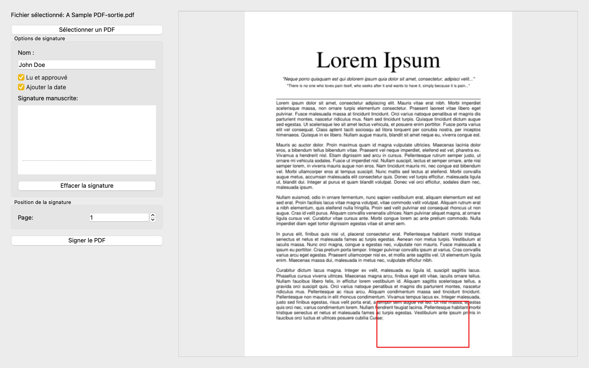

# PDF Signer

A simple and elegant desktop application for signing your PDF documents. Developed with Python and PyQt6.

## Advantages of Local Signing 🔒

- **Maximum Privacy**: Your documents stay on your computer, no upload to external servers
- **Security**: No risk of data leaks, everything is processed locally
- **Speed**: No internet connection needed, instant signing
- **Free**: No subscription or hidden fees, unlike online services
- **Offline**: Works without internet connection
- **No Limits**: Sign as many documents as you want
- **Data Protection**: GDPR compliant as no data is collected



## Features

- 📝 Handwritten or text signature
- 📄 Real-time PDF preview
- 🖱️ Precise signature placement
- ✍️ "Read and approved" option
- 📅 Automatic date addition
- 🎨 Modern and intuitive user interface

## Installation

1. Clone the repository
```bash
git clone https://github.com/bensaadmucret/PDF-Signer.git
cd PDF-Signer
```

2. Install dependencies
```bash
pip install -r requirements.txt
```

3. Run the application
```bash
python main.py
```

## Usage

1. Click "Select a PDF" to choose your document
2. Enter your name in the signature field
3. Choose your options:
   - Check "Read and approved" to add this mention
   - Check "Add date" to include the current date
4. Draw your signature in the designated area
5. Select the page where you want to place the signature
6. Click "Sign PDF" to generate your signed document

## Project Structure

```
PDF-Signer/
│
├── main.py              # Main application file
├── requirements.txt     # Python dependencies
├── icon.py             # Application icon
├── README.md           # Documentation (French)
└── README.en.md        # Documentation (English)
```

## Contribution

Contributions are welcome! Here's how to contribute:

1. Fork the project ([Click here to fork](https://github.com/bensaadmucret/PDF-Signer/fork))
2. Clone your fork
   ```bash
   git clone https://github.com/your-username/PDF-Signer.git
   cd PDF-Signer
   ```
3. Create your feature branch
   ```bash
   git checkout -b feature/amazing-feature
   ```
4. Commit your changes
   ```bash
   git add .
   git commit -m 'feat: Add amazing feature'
   ```
5. Push to the branch
   ```bash
   git push origin feature/amazing-feature
   ```
6. Open a Pull Request ([Create new Pull Request](https://github.com/bensaadmucret/PDF-Signer/compare))

### Commit Convention

Use these prefixes for your commits:
- `feat:` for a new feature
- `fix:` for a bug fix
- `docs:` for documentation
- `style:` for code formatting
- `refactor:` for code refactoring
- `test:` for adding or modifying tests
- `chore:` for code maintenance

### Contribution Guidelines

- Ensure your code follows Python coding standards (PEP 8)
- Add comments for complex code
- Update documentation when necessary
- Test your changes before submitting a PR

## License

This project is licensed under the MIT License - see the [LICENSE](LICENSE) file for details.

## Contact

Mohamed BENSAAD

Project Link: [https://github.com/bensaadmucret/PDF-Signer](https://github.com/bensaadmucret/PDF-Signer)
