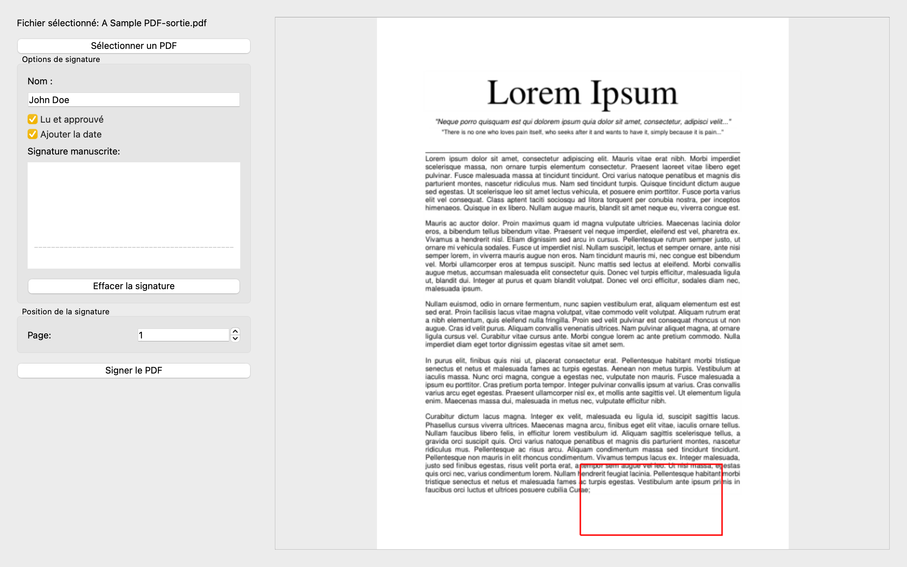

# PDF Signer

Une application de bureau simple et élégante pour signer vos documents PDF. Développée avec Python et PyQt6.



## Fonctionnalités

- 📝 Signature manuscrite ou textuelle
- 📄 Prévisualisation du PDF en temps réel
- 🖱️ Placement précis de la signature
- ✍️ Option "Lu et approuvé"
- 📅 Ajout automatique de la date
- 🎨 Interface utilisateur moderne et intuitive

## Installation

### Prérequis

- Python 3.9 ou supérieur
- pip (gestionnaire de paquets Python)

### Installation des dépendances

```bash
pip install -r requirements.txt
```

### Lancement de l'application

```bash
python main.py
```

### Installation comme application (macOS)

1. Installez PyInstaller :
```bash
pip install pyinstaller
```

2. Créez l'application :
```bash
pyinstaller PDF_Signer.spec
```

3. L'application se trouve dans le dossier `dist/PDF Signer`

## Utilisation

1. Lancez l'application
2. Cliquez sur "Sélectionner un PDF" pour ouvrir votre document
3. Entrez votre nom
4. Vous pouvez soit :
   - Dessiner votre signature dans la zone prévue
   - Utiliser votre nom comme signature (si aucune signature n'est dessinée)
5. Cochez les options souhaitées ("Lu et approuvé", date)
6. Cliquez sur le PDF à l'endroit où vous souhaitez placer la signature
7. Cliquez sur "Signer le PDF"
8. Le PDF signé sera sauvegardé avec le suffixe "_signed"

## Structure du projet

```
pdf_signer/
├── main.py           # Code principal de l'application
├── icon.py          # Générateur d'icône
├── requirements.txt  # Dépendances Python
├── PDF_Signer.spec  # Configuration PyInstaller
└── README.md        # Documentation
```

## Dépendances principales

- PyQt6 : Interface graphique
- PyMuPDF : Manipulation des PDF
- Pillow : Traitement d'images

## Contribution

Les contributions sont les bienvenues ! N'hésitez pas à :

1. Fork le projet
2. Créer une branche pour votre fonctionnalité (`git checkout -b feature/AmazingFeature`)
3. Commit vos changements (`git commit -m 'Add some AmazingFeature'`)
4. Push sur la branche (`git push origin feature/AmazingFeature`)
5. Ouvrir une Pull Request

## Licence

Distribué sous la licence MIT. Voir `LICENSE` pour plus d'informations.

## Contact

Votre nom - [@votre_twitter](https://twitter.com/votre_twitter)

Lien du projet : [https://github.com/votre_nom/pdf_signer](https://github.com/votre_nom/pdf_signer)
